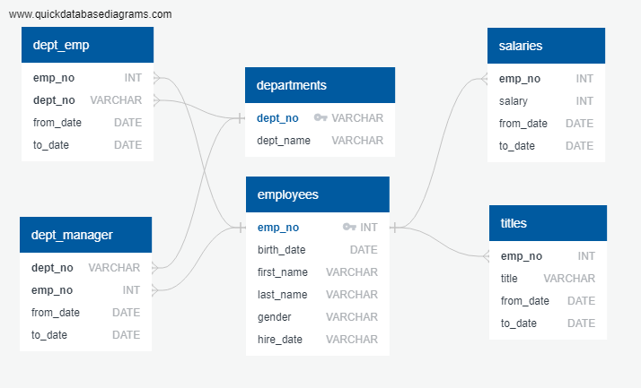

# Employee Database: A Mystery in Two Parts


## Background

It is a beautiful spring day, and it is two weeks since you have been hired as a new data engineer at Pewlett Hackard. Your first major task is a research project on employees of the corporation from the 1980s and 1990s. All that remain of the database of employees from that period are six CSV files.

In this assignment, you will design the tables to hold data in the CSVs, import the CSVs into a SQL database, and answer questions about the data. In other words, you will perform:

1. Data Modeling

2. Data Engineering

3. Data Analysis

## Instructions

#### Data Modeling

Inspect the CSVs and sketch out an ERD of the tables. Feel free to use a tool like [http://www.quickdatabasediagrams.com](http://www.quickdatabasediagrams.com).



#### Data Engineering

* Use the information you have to create a table schema for each of the six CSV files. Remember to specify data types, primary keys, foreign keys, and other constraints.

* Import each CSV file into the corresponding SQL table.


-- Exported from QuickDBD: https://www.quickdatabasediagrams.com/
-- NOTE! If you have used non-SQL datatypes in your design, you will have to change these here.

```sql
CREATE TABLE "departments" (
    "dept_no" VARCHAR   NOT NULL,
    "dept_name" VARCHAR   NOT NULL,
    CONSTRAINT "pk_departments" PRIMARY KEY (
        "dept_no"
     )
);

CREATE TABLE "dept_emp" (
    "emp_no" INT   NOT NULL,
    "dept_no" VARCHAR   NOT NULL,
    "from_date" DATE   NOT NULL,
    "to_date" DATE   NOT NULL
);

CREATE TABLE "dept_manager" (
    "dept_no" VARCHAR   NOT NULL,
    "emp_no" INT   NOT NULL,
    "from_date" DATE   NOT NULL,
    "to_date" DATE   NOT NULL
);

CREATE TABLE "employees" (
    "emp_no" INT   NOT NULL,
    "birth_date" DATE   NOT NULL,
    "first_name" VARCHAR   NOT NULL,
    "last_name" VARCHAR   NOT NULL,
    "gender" VARCHAR   NOT NULL,
    "hire_date" VARCHAR   NOT NULL,
    CONSTRAINT "pk_employees" PRIMARY KEY (
        "emp_no"
     )
);

CREATE TABLE "salaries" (
    "emp_no" INT   NOT NULL,
    "salary" INT   NOT NULL,
    "from_date" DATE   NOT NULL,
    "to_date" DATE   NOT NULL
);

CREATE TABLE "titles" (
    "emp_no" INT   NOT NULL,
    "title" VARCHAR   NOT NULL,
    "from_date" DATE   NOT NULL,
    "to_date" DATE   NOT NULL
);

ALTER TABLE "dept_emp" ADD CONSTRAINT "fk_dept_emp_emp_no" FOREIGN KEY("emp_no")
REFERENCES "employees" ("emp_no");

ALTER TABLE "dept_emp" ADD CONSTRAINT "fk_dept_emp_dept_no" FOREIGN KEY("dept_no")
REFERENCES "departments" ("dept_no");

ALTER TABLE "dept_manager" ADD CONSTRAINT "fk_dept_manager_dept_no" FOREIGN KEY("dept_no")
REFERENCES "departments" ("dept_no");

ALTER TABLE "dept_manager" ADD CONSTRAINT "fk_dept_manager_emp_no" FOREIGN KEY("emp_no")
REFERENCES "employees" ("emp_no");

ALTER TABLE "salaries" ADD CONSTRAINT "fk_salaries_emp_no" FOREIGN KEY("emp_no")
REFERENCES "employees" ("emp_no");

ALTER TABLE "titles" ADD CONSTRAINT "fk_titles_emp_no" FOREIGN KEY("emp_no")
REFERENCES "employees" ("emp_no");

--Perform QA To Ensure Tables Correctly Imported CSVs
SELECT * FROM departments LIMIT(5);
SELECT * FROM dept_emp LIMIT(5);
SELECT * FROM dept_manager LIMIT(5);
SELECT * FROM employees LIMIT(5);
SELECT * FROM salaries LIMIT(5);
SELECT * FROM titles LIMIT(5);
```
#### Data Analysis

Once you have a complete database, do the following:

1. List the following details of each employee: employee number, last name, first name, gender, and salary.

```sql
SELECT employees.emp_no, employees.last_name, employees.first_name, employees.gender, salaries.salary
FROM employees
JOIN salaries
ON employees.emp_no = salaries.emp_no 
ORDER BY employees.emp_no;
```

2. List employees who were hired in 1986.

```sql
SELECT first_name, last_name, hire_date 
FROM employees
WHERE hire_date BETWEEN '1986-01-01' AND '1986-12-31'
ORDER BY hire_date;
```

3. List the manager of each department with the following information: department number, department name, the manager's employee number, last name, first name, and start and end employment dates.

```sql
SELECT departments.dept_no, departments.dept_name, dept_manager.emp_no, employees.last_name, employees.first_name, dept_manager.from_date, dept_manager.to_date
FROM departments
JOIN dept_manager
ON departments.dept_no = dept_manager.dept_no
JOIN employees
ON dept_manager.emp_no = employees.emp_no
ORDER BY departments.dept_no;
```

4. List the department of each employee with the following information: employee number, last name, first name, and department name.

```sql
SELECT dept_emp.emp_no, employees.last_name, employees.first_name, departments.dept_name
FROM dept_emp
JOIN employees
ON dept_emp.emp_no = employees.emp_no
JOIN departments
ON dept_emp.dept_no = departments.dept_no
ORDER BY dept_emp.emp_no;
```

5. List all employees whose first name is "Hercules" and last names begin with "B."

```sql
SELECT first_name, last_name
FROM employees
WHERE first_name = 'Hercules'
AND last_name LIKE 'B%';
```

6. List all employees in the Sales department, including their employee number, last name, first name, and department name.

```sql
SELECT dept_emp.emp_no, employees.last_name, employees.first_name, departments.dept_name
FROM dept_emp
JOIN employees
ON dept_emp.emp_no = employees.emp_no
JOIN departments
ON dept_emp.dept_no = departments.dept_no
WHERE departments.dept_name = 'Sales'
ORDER BY dept_emp.emp_no;
```

7. List all employees in the Sales and Development departments, including their employee number, last name, first name, and department name.

```sql
SELECT dept_emp.emp_no, employees.last_name, employees.first_name, departments.dept_name
FROM dept_emp
JOIN employees
ON dept_emp.emp_no = employees.emp_no
JOIN departments
ON dept_emp.dept_no = departments.dept_no
WHERE departments.dept_name = 'Sales' 
OR departments.dept_name = 'Development'
ORDER BY dept_emp.emp_no;
```

8. In descending order, list the frequency count of employee last names, i.e., how many employees share each last name.

```sql
SELECT last_name,
COUNT(last_name) AS "frequency"
FROM employees
GROUP BY last_name
ORDER BY
COUNT(last_name) DESC;
```

## Bonus (Optional)

As you examine the data, you are overcome with a creeping suspicion that the dataset is fake. You surmise that your boss handed you spurious data in order to test the data engineering skills of a new employee. To confirm your hunch, you decide to take the following steps to generate a visualization of the data, with which you will confront your boss:

1. Import the SQL database into Pandas. (Yes, you could read the CSVs directly in Pandas, but you are, after all, trying to prove your technical mettle.) This step may require some research. Feel free to use the code below to get started. Be sure to make any necessary modifications for your username, password, host, port, and database name:

   ```sql
   from sqlalchemy import create_engine
   engine = create_engine('postgresql://localhost:5432/<your_db_name>')
   connection = engine.connect()
   ```

* Consult [SQLAlchemy documentation](https://docs.sqlalchemy.org/en/latest/core/engines.html#postgresql) for more information.

* If using a password, do not upload your password to your GitHub repository. See [https://www.youtube.com/watch?v=2uaTPmNvH0I](https://www.youtube.com/watch?v=2uaTPmNvH0I) and [https://martin-thoma.com/configuration-files-in-python/](https://martin-thoma.com/configuration-files-in-python/) for more information.

2. Create a bar chart of average salary by title.

3. You may also include a technical report in markdown format, in which you outline the data engineering steps taken in the homework assignment.

## Epilogue

Evidence in hand, you march into your boss's office and present the visualization. With a sly grin, your boss thanks you for your work. On your way out of the office, you hear the words, "Search your ID number." You look down at your badge to see that your employee ID number is 499942.

## Submission

* Create an image file of your ERD.

* Create a `.sql` file of your table schemata.

* Create a `.sql` file of your queries.

* (Optional) Create a Jupyter Notebook of the bonus analysis.

* Create and upload a repository with the above files to GitHub and post a link on BootCamp Spot.
